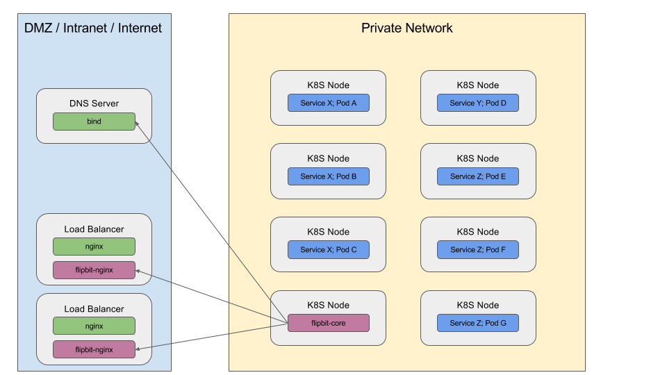
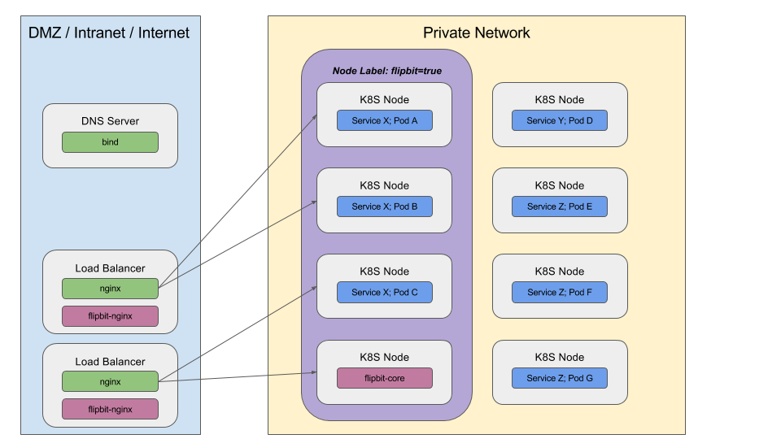

# Flipbit
External load balancing and service discovery for the rest of us

## Overview
Kubernetes is a great environment, with built in load balancing and service discovery.  While there are built-in 
solutions to enable this to external clients within popular public cloud options, there lacks a cohesive solution for 
bare metal installations.  Flipbit aims to remedy this.
 
Flipbit will work with existing load balancers and DNS servers to synchronize your kubernetes environment with 
the external resources.

Not all services created in Kubernetes needs to be exposed to external clients.  Therefore flipbit gives you th 
ability to indicate which services should be exposed and which should not.

## Design

Flipbit is designed to be run and managed within the kubernetes cluster.  While there may be helper programs that 
are needed to be run outside of the kubernetes cluster, these helper programs merely enforce the desires of the 
centrally-run program.

* flipbit-core ([documentation](flipbit-core/README.md))
  * `flipbit-core` keeps track of services scheduled within kubernetes and will inform the load balancers of 
  necessary entries that need to be created or maintained
  * Based on the information returned by the load balancers, a DNS server can be updated with the 
  load balancer-provided IP addresses for any given service
* flipbit-nginx ([documentation](flipbit-nginx/README.md))
  * `flipbit-nginx` is a program that will maintain stream configuratino for a nginx server.
  

Flipbit can be instructed to route load balancer traffic to a subset of nodes.  This can be done to provide 
nodes optimized for traffic.  As Kubernetes nodes come and go from the cluster, load balancers will need to be 
updated with nodes that are in service.

## Definitions and Support

### Load Balancer
A load balancer host is a machine that is put into service to handle service traffic from external (outside kubernetes) 
users/clients.  This machine should have multiple IP addresses bound to it and the ability to hand them out as needed 
to kubernetes services.

Load balancers will forward TCP or UDP connections form external clients to a pool of upstream servers.  Not all load 
balancing software is the same, for example, some do not support UDP.

It is presumed that there is already knowledge of how to operate load balancing software.  flipbit will create the 
configurations as needed and help coordinate hot-restarts (where possible) of the load balancing software, but 
flipbit does not directly run the load balancing software

#### Example

Assume you have the following situation
* 3 Load Balancers
  * LB 1 - Has 192.168.1.0/24 bound to the machine
  * LB 2 - Has 192.168.5.0/24 bound to the machine
  * LB 3 - Has 192.168.7.0/24 bound to the machine
* 3 Services
  * Front End (www) of a blog
    * Has ports `80` and `443` opened (natively)
    * Configured to enable flipbit
    * Has node ports assigned
  * Back end of a blog
    * Has port `443` opened (natively)
    * Configured to disable flipbit
    * Has no node ports assigned
  * Dashboard of a system
    * Has port `443` opened (natively)
    * Configured to enable flipbit
    * Has node ports assigned
* 5 Kubernetes Nodes
  * Each have been marked to handle flipbit-driven requests by having a label applied to the node
  * IP Addresses are `10.0.0.10`, `10.0.0.11`, `10.0.0.12`, `10.0.0.13`, `10.0.0.14`
    
The resulting situation may look like

| Service Name in K8S | Namespace in K8S | Flipbit Enabled | Native Ports | Node Ports | External LB IPs | External LB Ports | K8S Nodes Used | 
| --- | --- | --- | --- | --- | --- | --- | --- |
| frontend | blog | true | 80, 443 | 30101, 30102 | 192.168.1.5, 192.168.5.3, 192.168.7.2 | 80, 443 | 10.0.0.2, 10.0.0.4, 10.0.0.5 |
| backend | blog | false | 443 | none | none | none | none |
| dashboard | systemb | true | 443 | 30201 | 192.168.1.4, 192.168.5.2, 192.168.7.3 | 443 | 10.0.0.1, 10.0.0.3, 10.0.0.5 |
 
Each IP address assigned by the load balancer is determined by the load balancer itself.  Flipbit will know what 
IPs are assigned, but these IPs could change base on the load balancer program.  The goal would be to keep the IPs 
constant provided they are continually used.

#### Supported Load Balancers
* nginx (TCP and UDP)
* HAProxy (TCP only) _(roadmap)_

### DNS
flipbit will synchronize services given IP addresses by external load balancers with DNS names.

#### Example

Suppose we have a DNS domain `k8s.cnct.io` that we want to issue DNS names under.
Assume we have a similar blend of services and nodes

| Service Name in K8S | Namespace in K8S | Flipbit Enabled | External LB IPs | DNS name |
| --- | --- | --- | --- | --- |
| frontend | blog | true | 192.168.1.5, 192.168.5.3, 192.168.7.2 | frontend.blog.k8s.cnct.io |
| backend | blog | false | none | none | none |
| dashboard | systemb | true | 192.168.1.4, 192.168.5.2, 192.168.7.3 | dashboard.systemb.k8s.cnct.io | 

#### Supported DNS Servers
* nsupdate -compatible DNS Servers _(coming soon)_ 
* Active Directory _(roadmap)_

### 
